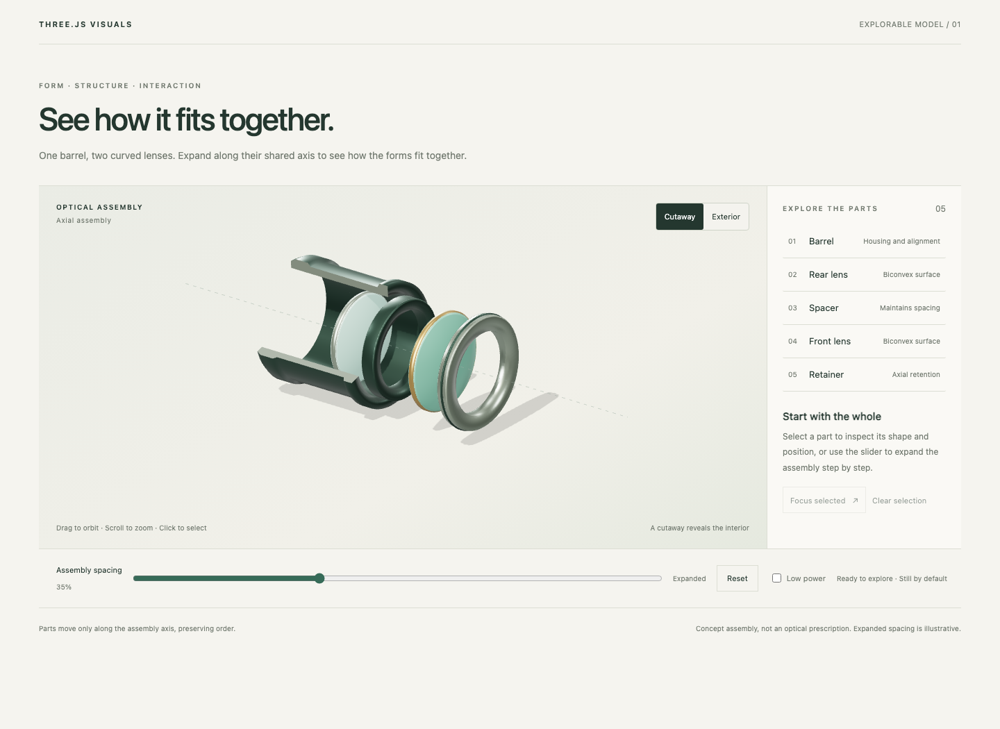

# Three.js Visuals

A Codex plugin for beautiful non-game 3D scenes and elegant interaction. One entry point: `$threejs-visuals`.

Create technical illustrations, explorable models, product presentations, and interactive scenes for the web. Understand the content, find relevant inspiration, agree on a design language, and refine a representative scene before expanding. Aesthetic decisions guide modeling; spatial relationships stay accurate.



## How it works

- **Start with intent.** Understand the audience, objects, relationships, and host page before choosing forms or composition.
- **Turn references into decisions.** Connect what is actually visible to its effect and a concrete choice for the current work.
- **Choose with working demos.** When direction is unresolved, compare a few real alternatives, preferably built by parallel subagents. Inspect them before asking the user to choose.
- **Refine what matters.** Work from silhouette, proportion, and composition toward materials, lighting, and interaction. Preserve the chosen language across iterations.
- **Verify the result.** Inspect real screenshots and operate the scene. Check occlusion, responsive layout, keyboard/touch input, performance, and useful fallbacks.

The process scales to the task. A focused interaction fix does not restart design research; a review request does not authorize edits. Existing design systems, frameworks, and Three.js versions remain project decisions. No mandatory React, React Three Fiber, GSAP, or paid generation service.

## Install

Add `https://github.com/HaidongPang/threejs-visuals` in the Codex marketplace interface, then install **Three.js Visuals**. Or use the CLI:

```sh
codex plugin marketplace add https://github.com/HaidongPang/threejs-visuals
codex plugin add threejs-visuals@threejs-visuals
```

Codex fetches the remote marketplace and plugin. No manual clone, registration script, Python, or npm is needed for installation. Start a new Codex task to use `$threejs-visuals`.

## Examples of use

```text
$threejs-visuals Create an explorable model for a heat sink product page.
Analyze the audience and structure, then find strong community references.
The design language is undecided: show two working demos, preferably
built by parallel subagents, so I can choose a direction.
```

```text
$threejs-visuals This scene looks generic. Keep the existing design system.
Inspect the actual image and refine silhouette, proportion, composition,
and materials, comparing the result after each meaningful change.
```

```text
$threejs-visuals Refine selection, focus, explosion, and reset.
Make core actions work with touch and keyboard while preserving
the chosen visual direction.
```

```text
$threejs-visuals Review this scene for visual quality, spatial accuracy,
and interaction. Use actual images and input evidence. Do not edit files.
```

## Run the examples

For development in a working copy of this repository, use Node.js and Python 3:

```sh
npm ci
npx playwright install chromium
npm run dev
```

Open the [optical assembly](http://127.0.0.1:4173/examples/optical-assembly/) or the [direction comparison](http://127.0.0.1:4173/examples/directions/). The preview listens on `127.0.0.1:4173`; stop it with Ctrl-C.

In another terminal, run the main browser suite:

```sh
npm test
```

The two direction studies have separate checks:

```sh
node examples/directions/section-study/validate.mjs
node examples/directions/product-study/verify.mjs
```

Examples use plain ES modules with `three@0.186.0` and `@playwright/test@1.63.0` pinned by the lockfile. No build step is needed. These dependencies are for examples, not plugin installation.

[Verification results](docs/VALIDATION.md) distinguish automated checks, visual observations, and remaining limits. The [demo brief](docs/DEMO-BRIEF.md) explains the content and design choices.

## Layout

```text
.agents/plugins/marketplace.json   Remote marketplace with one plugin
.codex-plugin/plugin.json         Plugin manifest
skills/threejs-visuals/SKILL.md    Main entry point
skills/threejs-visuals/references/ Task-specific guidance
examples/                         Optical assembly and direction studies
tests/                            Browser interaction and lifecycle checks
docs/                             Brief and verification evidence
licenses/                         Third-party license notices
```

## Update or uninstall

Refresh the marketplace and reinstall, then start a new task:

```sh
codex plugin marketplace upgrade threejs-visuals
codex plugin add threejs-visuals@threejs-visuals
```

Uninstall:

```sh
codex plugin remove threejs-visuals@threejs-visuals
```

## License

[MIT](LICENSE). Required third-party notices are retained in [licenses/](licenses/).
